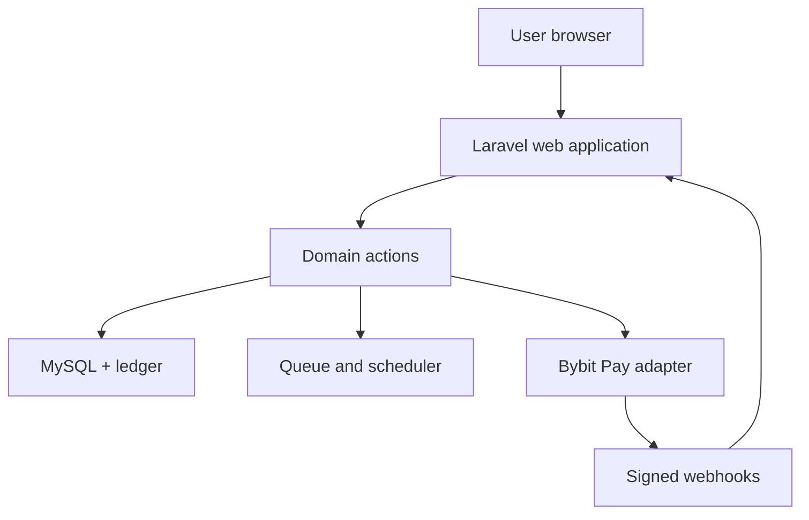
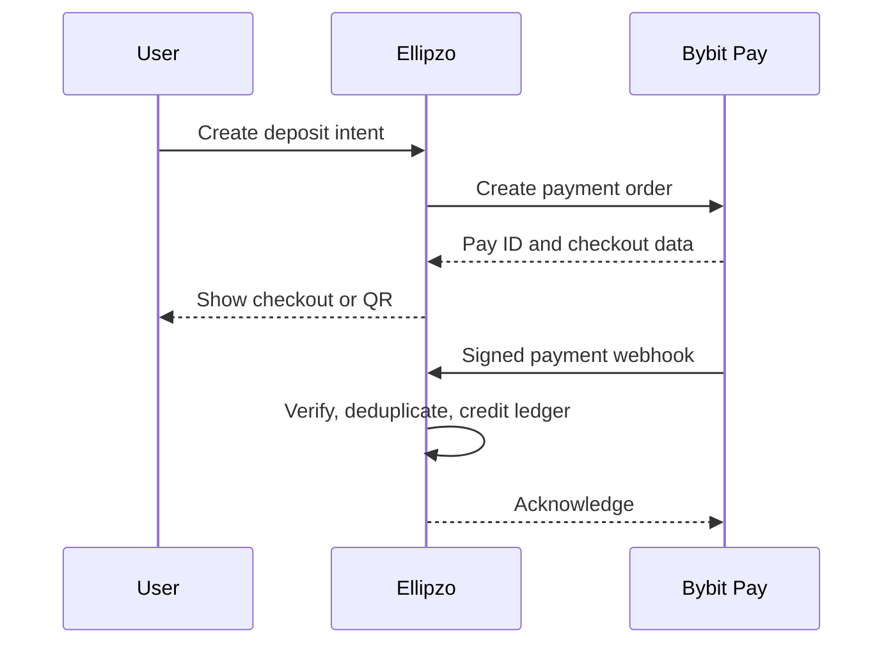
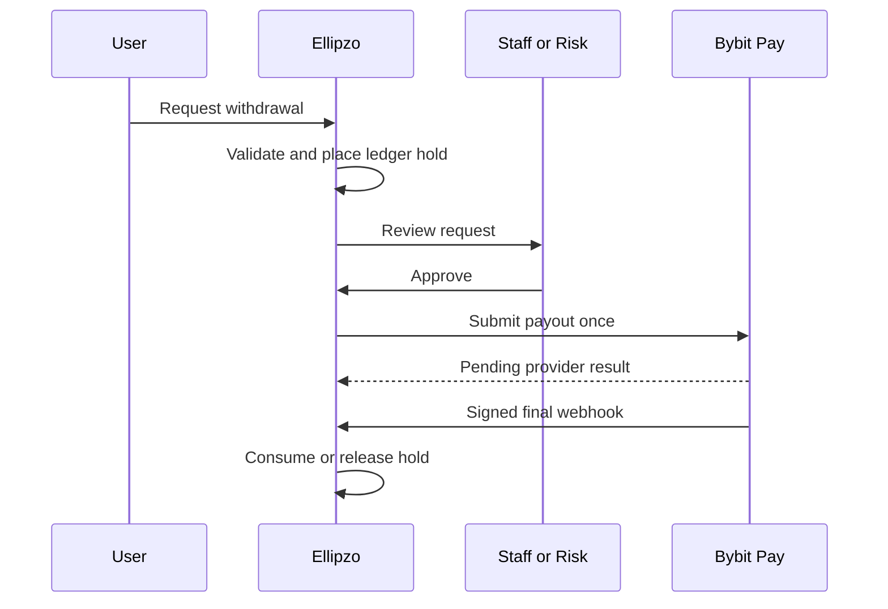

# Ellipzo Application Architecture

**Document version:** 1.0  
**Status:** Proposed production architecture  
**Last updated:** 2026-07-23

## 1. Architecture Decision

Ellipzo will be a modular Laravel monolith.

This architecture keeps deployment and transactions simple while the product is growing. It also allows domains such as payments, tasks, advertising, and support to be separated clearly inside one codebase. Do not split the first release into microservices.

### Chosen stack

| Layer | Choice |
| --- | --- |
| Backend | Laravel 13 |
| Language | PHP 8.3+ |
| Frontend | React 19 + TypeScript |
| App bridge | Inertia 3 |
| Styling | Tailwind CSS 4 |
| UI foundation | shadcn/ui primitives, customized to Ellipzo |
| Bundler | Vite |
| Database | MySQL 8 |
| Cache | Database initially; Redis when infrastructure supports it |
| Queue | Database queue initially; Redis queue on VPS |
| Scheduler | Laravel scheduler through cron |
| Authentication | Laravel session authentication |
| Social login | Laravel Socialite for Google |
| Authorization | Laravel policies/gates; Spatie Laravel Permission for staff roles only |
| Testing | Pest for PHP, Vitest/React Testing Library for components, Playwright for critical journeys |
| Code style | Laravel Pint + ESLint + Prettier |
| Mail | Laravel Mail with environment-configured SMTP provider |
| File storage | Laravel private filesystem; S3-compatible object storage when scaling |
| Monitoring | Structured application logs plus configurable error monitoring |

Lock exact dependency versions in `composer.lock` and the JavaScript lockfile. Claude must read installed versions before using package-specific APIs.

Official framework references checked on 2026-07-23:

- [Laravel 13 release notes](https://laravel.com/docs/13.x/releases)
- [Laravel 13 React starter kit](https://laravel.com/docs/13.x/starter-kits)

## 2. Architectural Boundaries

### 2.1 Client

The React client:

- Renders pages and interaction states.
- Submits forms to Laravel routes.
- Displays values already authorized and calculated by the server.
- Never calculates authoritative balances, rewards, fees, reservations, or payment state.
- Never receives Bybit API secrets.
- Never credits a deposit from a return URL.

### 2.2 Application

Laravel:

- Authenticates browser sessions.
- Validates all input.
- Applies country, age, account, and feature policies.
- Authorizes actions through policies and permissions.
- Coordinates use cases through actions/services.
- Opens database transactions for financial state changes.
- Dispatches safe background work.
- Produces Inertia responses and webhook responses.

### 2.3 Domain

Domain modules own:

- Business rules.
- Status transitions.
- Money value objects.
- Ledger entries.
- Campaign reservation and spend.
- Submission settlement.
- Deposit and withdrawal orchestration.
- Provider-independent interfaces.

Controllers must stay thin. They validate/authorize, call one application action, and return a response.

### 2.4 Infrastructure

Infrastructure adapters own:

- Bybit Pay HTTP requests.
- Webhook signature verification.
- Email delivery.
- File storage.
- Queue drivers.
- Geolocation hints.
- Error monitoring.

External services must be behind interfaces so tests can use fakes.

## 3. High-Level App Flow



### Request lifecycle

1. Browser sends a request with a secure session cookie.
2. Middleware resolves authentication, locale, country policy, account state, and feature flags.
3. Form Request validates the payload.
4. Policy authorizes the resource operation.
5. An action applies business rules.
6. Financial changes run inside a database transaction with locks and idempotency.
7. Domain events are recorded and queued side effects are dispatched after commit.
8. Controller returns an Inertia page, redirect with flash message, or a normalized JSON response.

## 4. Primary Domain Modules

| Module | Responsibility |
| --- | --- |
| Identity | Registration, verification, sessions, profile, eligibility, security |
| Access | Staff roles, permissions, policies, country capabilities |
| Earnings | Task discovery, starts/reservations, submissions, reviews |
| Advertising | Campaigns, budgets, targeting, moderation, review queues |
| Wallet | Accounts, ledger transactions, balances, holds, reservations |
| Payments | Deposit and withdrawal intents, provider state, reconciliation |
| BybitPay | Signing, requests, response mapping, webhook verification |
| Surveys | Survey-provider adapters and rewards |
| Offerwalls | Offerwall-provider adapters, callbacks, chargebacks |
| Referrals | Attribution, eligible commission, anti-abuse signals |
| Disputes | Submission disputes and resolution |
| Support | Tickets, replies, attachments, links to authorized records |
| Notifications | In-app and email notifications |
| Risk | Rules, signals, limits, reviews, decisions |
| Admin | Staff workflows and configuration |
| Audit | Append-only record of sensitive actions |
| Shared | Money, identifiers, clocks, idempotency, common exceptions |

Modules may reference another module only through an explicit action, query, event, or contract. Avoid reaching across modules to modify another module's models directly.

## 5. Recommended Repository Structure

```text
ellipzo/
├── .ai/
│   └── guidelines/
│       └── ellipzo.md
├── app/
│   ├── Console/
│   │   └── Commands/
│   ├── Domain/
│   │   ├── Identity/
│   │   │   ├── Actions/
│   │   │   ├── Data/
│   │   │   ├── Enums/
│   │   │   ├── Events/
│   │   │   ├── Models/
│   │   │   ├── Policies/
│   │   │   └── Services/
│   │   ├── Access/
│   │   ├── Earnings/
│   │   ├── Advertising/
│   │   ├── Wallet/
│   │   ├── Payments/
│   │   ├── Surveys/
│   │   ├── Offerwalls/
│   │   ├── Referrals/
│   │   ├── Disputes/
│   │   ├── Support/
│   │   ├── Notifications/
│   │   ├── Risk/
│   │   ├── Admin/
│   │   ├── Audit/
│   │   └── Shared/
│   │       ├── Contracts/
│   │       ├── Exceptions/
│   │       ├── Money/
│   │       └── Support/
│   ├── Http/
│   │   ├── Controllers/
│   │   │   ├── Auth/
│   │   │   ├── Earn/
│   │   │   ├── Advertise/
│   │   │   ├── Wallet/
│   │   │   ├── Support/
│   │   │   ├── Admin/
│   │   │   └── Webhooks/
│   │   ├── Middleware/
│   │   └── Requests/
│   ├── Infrastructure/
│   │   ├── Payments/
│   │   │   └── BybitPay/
│   │   │       ├── BybitPayClient.php
│   │   │       ├── BybitPayWebhookVerifier.php
│   │   │       ├── Data/
│   │   │       ├── Exceptions/
│   │   │       └── FakeBybitPayClient.php
│   │   ├── Files/
│   │   ├── Geo/
│   │   └── Monitoring/
│   ├── Jobs/
│   ├── Listeners/
│   ├── Mail/
│   ├── Notifications/
│   ├── Providers/
│   └── Support/
├── bootstrap/
├── config/
│   ├── ellipzo.php
│   ├── payments.php
│   ├── risk.php
│   └── services.php
├── database/
│   ├── factories/
│   ├── migrations/
│   └── seeders/
├── docs/
│   ├── prd.md
│   ├── Architecture.md
│   ├── rules.md
│   ├── phases.md
│   ├── design.md
│   └── memory.md
├── public/
├── resources/
│   ├── css/
│   │   └── app.css
│   └── js/
│       ├── components/
│       │   ├── ui/
│       │   ├── forms/
│       │   ├── data-display/
│       │   ├── feedback/
│       │   └── domain/
│       ├── hooks/
│       ├── layouts/
│       │   ├── public-layout.tsx
│       │   ├── app-layout.tsx
│       │   ├── admin-layout.tsx
│       │   └── auth-layout.tsx
│       ├── lib/
│       ├── pages/
│       │   ├── public/
│       │   ├── auth/
│       │   ├── dashboard/
│       │   ├── earn/
│       │   ├── advertise/
│       │   ├── wallet/
│       │   ├── referrals/
│       │   ├── support/
│       │   ├── settings/
│       │   └── admin/
│       ├── types/
│       └── app.tsx
├── routes/
│   ├── web.php
│   ├── auth.php
│   ├── admin.php
│   ├── webhooks.php
│   └── console.php
├── storage/
├── tests/
│   ├── Architecture/
│   ├── Feature/
│   │   ├── Auth/
│   │   ├── Earnings/
│   │   ├── Advertising/
│   │   ├── Wallet/
│   │   ├── Payments/
│   │   ├── Support/
│   │   └── Admin/
│   ├── Unit/
│   └── Browser/
├── composer.json
├── package.json
├── phpunit.xml
├── pint.json
├── vite.config.ts
└── README.md
```

Use lowercase route/page directory names and PSR-4 PHP namespaces. Do not create generic dumping grounds such as `Helpers.php`, `Utils.php`, or a single oversized `Services` folder.

## 6. Route Architecture

### Public routes

- `/`
- `/how-it-works`
- `/earn`
- `/advertise`
- `/help`
- `/legal/{document}`

### Authenticated user routes

- `/dashboard`
- `/tasks`
- `/tasks/{task}`
- `/submissions`
- `/advertise`
- `/advertise/funds`
- `/advertise/campaigns`
- `/advertise/campaigns/create`
- `/advertise/reviews`
- `/wallet/transactions`
- `/withdrawals`
- `/referrals`
- `/notifications`
- `/support`
- `/settings/*`

### Staff routes

All staff routes use `/admin`, staff authentication middleware, permission checks, and audit middleware.

### Webhook routes

- Must be isolated in `routes/webhooks.php`.
- Must not use browser CSRF middleware.
- Must use provider authentication/signature middleware or verification inside a dedicated handler.
- Must have strict body-size limits and rate controls.
- Must store a safe event record before further processing.
- Must return quickly after verification and durable persistence.

## 7. Database Architecture

### 7.1 Identity and access

- `users`
- `user_profiles`
- `user_consents`
- `user_security_events`
- `sessions`
- `roles`
- `permissions`
- `model_has_roles`
- `model_has_permissions`
- `countries`
- `country_capabilities`
- `feature_flags`

### 7.2 Tasks and advertising

- `categories`
- `campaigns`
- `campaign_targets`
- `campaign_proof_fields`
- `campaign_status_history`
- `task_reservations`
- `submissions`
- `submission_answers`
- `submission_files`
- `submission_status_history`
- `disputes`
- `dispute_messages`
- `dispute_status_history`

### 7.3 Wallet and payments

- `wallet_accounts`
- `ledger_transactions`
- `ledger_entries`
- `balance_snapshots`
- `campaign_fund_reservations`
- `deposit_intents`
- `withdrawal_requests`
- `payment_provider_events`
- `payment_attempts`
- `reconciliation_runs`
- `reconciliation_items`
- `idempotency_keys`

### 7.4 Other modules

- `referrals`
- `referral_commissions`
- `survey_providers`
- `survey_events`
- `offerwall_providers`
- `offerwall_events`
- `support_tickets`
- `support_messages`
- `notifications`
- `risk_signals`
- `risk_reviews`
- `audit_events`
- `settings`

### 7.5 Identifier policy

- Use ULIDs for public-facing primary identifiers where supported.
- Never expose sequential internal IDs as proof of authorization.
- Provider identifiers and merchant trade numbers have unique indexes.
- Usernames and emails use normalized unique indexes.
- Foreign keys and common status/filter columns are indexed.

### 7.6 Money storage

Use integer atomic units:

```text
amount_atomic = human amount × 10^currency_scale
```

Example: if USDT scale is 8, `1.25 USDT` is stored as `125000000`.

Rules:

- Store `currency_code` and `currency_scale`.
- Use signed `BIGINT` only in ledger entries where debits and credits require it.
- Validate overflow before arithmetic.
- Format with a Money value object.
- Do not use PHP floats, JavaScript numbers, or MySQL `FLOAT/DOUBLE` for financial arithmetic.
- JavaScript receives formatted strings and atomic values as strings.

### 7.7 Ledger model

Each `ledger_transaction` contains two or more `ledger_entries` whose signed total is zero for a currency.

Example submission approval:

- Debit advertiser campaign-reserve account.
- Credit earner available-earnings account.
- Credit platform-fee account if the pricing model includes a fee.
- Any additional debit needed to keep the transaction balanced.

The exact chart of accounts must be defined before Phase 2 migrations are accepted.

Database constraints and tests must enforce:

- No orphan entries.
- No unbalanced committed transaction.
- Unique business reference per financial event.
- No negative available balance unless an explicitly authorized system account permits it.
- Immutable committed entries.

## 8. Bybit Pay Integration Architecture

### 8.1 Provider contract

```php
interface PaymentProvider
{
    public function createDeposit(CreateDepositData $data): ProviderDeposit;
    public function queryPayment(QueryPaymentData $data): ProviderPayment;
    public function createPayout(CreatePayoutData $data): ProviderPayout;
}
```

The application depends on this contract. `BybitPayClient` implements it. Tests use `FakeBybitPayClient`.

### 8.2 Deposit flow



Implementation rules:

1. Create the internal intent first.
2. Generate the merchant trade number once and never reuse it.
3. Store the provider request fingerprint and safe response fields.
4. On webhook, capture the raw body before parsing.
5. Verify signature, timestamp, merchant, amount, currency, and order identity.
6. Insert the provider event with a unique constraint.
7. Lock the deposit row.
8. If already final, acknowledge without creating another ledger entry.
9. Transition to paid and credit advertising funds in one database transaction.
10. Dispatch notification after commit.

Current official Bybit Pay documentation describes one-time QR payment creation, a payment-result query, signed webhooks, sandbox status mocking, refunds, payouts, and settlement reporting. Treat its current documentation as authoritative at implementation time; never rely solely on copied endpoint examples in this file.

Official payment references checked on 2026-07-23:

- [Bybit Pay guide](https://bybit-exchange.github.io/pay-docs/guide)
- [Bybit Pay authentication](https://bybit-exchange.github.io/pay-docs/scan-payment/guide)
- [Create payment](https://bybit-exchange.github.io/pay-docs/scan-payment/create-payment)
- [Payment notification webhook](https://bybit-exchange.github.io/pay-docs/scan-payment/payment-notify)
- [Payout](https://bybit-exchange.github.io/pay-docs/scan-payment/payout)
- [Bybit Pay changelog](https://bybit-exchange.github.io/pay-docs/changelog/bybit-pay)

### 8.3 Withdrawal flow



Implementation rules:

- A controller never calls the payout endpoint directly.
- A database transaction creates the request and hold.
- Approval dispatches a uniquely keyed payout job.
- The payout job obtains a row lock and checks whether submission already happened.
- A network timeout after sending creates `REVIEW_REQUIRED`; it must not immediately resend.
- Webhook and reconciliation share the same centralized transition action.
- Final payout success consumes the hold.
- Confirmed failure releases the hold through compensating ledger entries.

### 8.4 Webhook security

- Use the official current signature algorithm.
- Verify against the exact raw body.
- Reject missing/invalid signature or stale timestamp.
- Support configured Bybit public keys and rotation.
- Apply provider IP allowlisting only as an additional control, never as a substitute for signatures.
- Store a hash of the raw body and only the safe fields needed for audit.
- Redact authorization headers, secrets, personal data, and full payloads from normal logs.
- Accept duplicate valid events safely.
- Process out-of-order states through the state machine.

### 8.5 Reconciliation

Scheduled reconciliation:

- Queries internal pending deposits and withdrawals.
- Compares provider results with internal state.
- Creates review items for mismatches.
- Never silently changes a ledger balance from a report without a validated transition.
- Produces counts and correlation IDs for finance staff.
- Supports settlement-report comparison when the merchant capability is available.

## 9. Authorization Architecture

### Normal users

Normal users do not receive `earner` or `advertiser` roles. Ownership and eligibility policies decide whether they can:

- Start a task.
- Submit proof.
- Create a campaign.
- Review their campaign submissions.
- Deposit or withdraw.
- Open or respond to a ticket.

### Staff

Staff permissions are granular, for example:

- `users.view`
- `users.limit`
- `campaigns.moderate`
- `submissions.moderate`
- `disputes.resolve`
- `deposits.review`
- `withdrawals.review`
- `withdrawals.approve`
- `ledger.adjust`
- `settings.manage`
- `staff.manage`
- `audit.view`

No UI visibility check replaces backend authorization.

## 10. State Machines

Use backed PHP enums plus dedicated transition classes. Do not scatter status strings through controllers.

Each transition must define:

- Allowed origin state.
- Target state.
- Required actor/permission.
- Preconditions.
- Database changes.
- Ledger impact.
- Domain events.
- Audit metadata.

Tests must cover every allowed and forbidden transition.

## 11. Error Handling

### User-facing errors

- Validation errors return field-specific messages.
- Authorization errors return a neutral 403 page or response.
- Missing records return 404 without leaking ownership.
- Conflict/idempotency errors return 409 where JSON is used.
- Rate limiting returns 429 with a safe retry message.
- Provider outage returns a temporary-unavailable message and preserves internal state.

### Internal errors

Create typed exceptions:

- `InsufficientBalance`
- `InvalidStateTransition`
- `DuplicateFinancialEvent`
- `EligibilityDenied`
- `ProviderUnavailable`
- `ProviderResponseUnknown`
- `WebhookVerificationFailed`
- `LedgerInvariantViolation`

Expected business exceptions become safe messages. Unexpected exceptions are logged with a correlation ID and shown as a generic error.

Never expose:

- Stack traces.
- SQL.
- File paths.
- API keys or signatures.
- Raw provider payloads.
- Another user's identifiers.

## 12. Background Jobs

Good queue candidates:

- Send email and non-critical notifications.
- Process a durably stored verified provider event.
- Submit an approved payout.
- Query pending provider transactions.
- Reconcile settlements.
- Generate exports.
- Calculate non-authoritative analytics.
- Clean expired reservations and temporary uploads.

Queue rules:

- Dispatch financial side effects after database commit.
- Jobs must be idempotent.
- Define timeouts, bounded attempts, and backoff.
- Never use infinite retries.
- A failed or uncertain payment job creates an operational review item.
- Job payloads contain IDs, not secrets or full models.

## 13. Caching

- Do not cache authoritative balances or payment state as the only source.
- Cache public configuration, categories, and safe task-list queries.
- Tag or version cached data where the driver supports it.
- Invalidate on relevant changes.
- The application must remain correct when the cache is empty.

## 14. File Upload Architecture

- Store proof and ticket attachments outside the public web root.
- Use randomized storage names.
- Preserve the sanitized original name only as metadata.
- Validate MIME type, extension, size, and image dimensions.
- Reject executables, scripts, HTML, and SVG.
- Serve through an authorized controller or short-lived signed URL.
- Set safe content-disposition headers.
- Remove image metadata when practical.
- Define retention and deletion jobs.

## 15. Testing Architecture

### Unit tests

- Money arithmetic and scale.
- Status transitions.
- Campaign budget calculations.
- Ledger balancing.
- Fee and limit rules.
- Signature verification using official test fixtures.

### Feature tests

- Authentication and verification.
- Ownership and staff authorization.
- Task eligibility and submission.
- Concurrent campaign reservations.
- Approval settlement.
- Deposit webhook idempotency.
- Withdrawal hold, approval, success, and failure.
- Duplicate and out-of-order provider events.
- Support ticket privacy.
- Administrative adjustment audit.
- Country and age restrictions.

### Browser tests

- Register and verify.
- Complete a task submission.
- Fund a sandbox advertising balance.
- Create and moderate a campaign.
- Review a submission and dispute.
- Request and review a sandbox withdrawal.

Every financial bug gets a regression test.

## 16. Deployment Profiles

### Local

- PHP 8.3+
- Composer
- Node.js compatible with the locked frontend toolchain
- MySQL 8
- Mail catcher
- Queue worker
- Scheduler
- Bybit Pay sandbox configuration only

### Hostinger shared hosting compatibility

The application may begin on a compatible Hostinger plan if it provides the required PHP version, Composer workflow, cron, HTTPS, MySQL, environment configuration, and private storage.

- Build frontend assets before deployment if Node is unavailable on the server.
- Use the database cache/session/queue drivers.
- Run the scheduler every minute through cron.
- Drain database jobs through a safe cron strategy if an always-on worker is unavailable.
- Disable real-time websocket assumptions.
- Keep webhook handlers short and durable.

Live payment launch should move to infrastructure with an always-on supervised queue worker, reliable backups, monitoring, and controlled deployments if shared-hosting limitations weaken payment reliability.

### Preferred production

- Hostinger VPS or equivalent.
- Nginx.
- PHP-FPM 8.3+.
- MySQL 8 with automated backups.
- Redis for cache, sessions, rate limiting, and queues.
- Supervisor or systemd for queue workers.
- Cron for Laravel scheduler.
- TLS, firewall, restricted database access, log rotation, and monitoring.
- Separate staging and production environments.

## 17. Configuration and Secrets

Expected environment configuration includes:

```text
APP_ENV
APP_KEY
APP_URL
DB_*
MAIL_*
GOOGLE_CLIENT_ID
GOOGLE_CLIENT_SECRET
BYBIT_PAY_ENV
BYBIT_PAY_API_KEY
BYBIT_PAY_PRIVATE_KEY_OR_SECRET
BYBIT_PAY_MERCHANT_ID
BYBIT_PAY_WEBHOOK_PUBLIC_KEY
BYBIT_PAY_VERSION
```

Rules:

- `.env` is never committed.
- `.env.example` contains names and safe descriptions, never real values.
- Production and sandbox credentials are separate.
- The application refuses to boot payment workers if required configuration is invalid.
- Secrets are never passed to Inertia props, logs, jobs, browser errors, or database audit text.
- Key rotation must be possible without rewriting domain code.

## 18. Observability

- Correlation ID on requests, jobs, and provider calls.
- Structured logs with actor, action, entity type, entity ID, result, and safe error code.
- Metrics for queue health, webhook verification failures, provider latency, pending payments, reconciliation differences, and ledger checks.
- Alerts for repeated payout failures, growing pending queues, balance mismatches, and invalid webhook spikes.
- Audit events are separate from diagnostic logs.

## 19. Dependency Rules

Approved initial dependencies:

- Official Laravel packages where possible.
- `laravel/socialite` for Google authentication.
- `spatie/laravel-permission` for staff authorization.
- `spatie/laravel-activitylog` only if configured as a supplement to, not a replacement for, explicit financial audit records.
- `pestphp/pest` for PHP tests.
- `lucide-react` for icons.
- shadcn/ui components copied into the repository and restyled through tokens.

Do not add:

- A second authentication framework.
- Multiple component libraries.
- A JavaScript money library as the authority for server money.
- An unofficial Bybit package when Laravel's HTTP client and the official protocol are sufficient.
- A package merely to avoid writing a small, well-tested domain value object.
- Abandoned or unmaintained packages.

Any new dependency requires a reason in `memory.md`, license compatibility, security review, and tests.

## 20. Architecture Definition of Done

A module is architecturally complete when:

- Requirements are traced to actions and tests.
- Authorization is enforced server-side.
- States and transitions are centralized.
- Financial changes use the ledger.
- External integrations are behind contracts.
- Error and empty states exist.
- Logs contain correlation IDs and no secrets.
- Tests cover normal, forbidden, duplicate, concurrent, and failure paths.
- Documentation and `memory.md` are updated.
